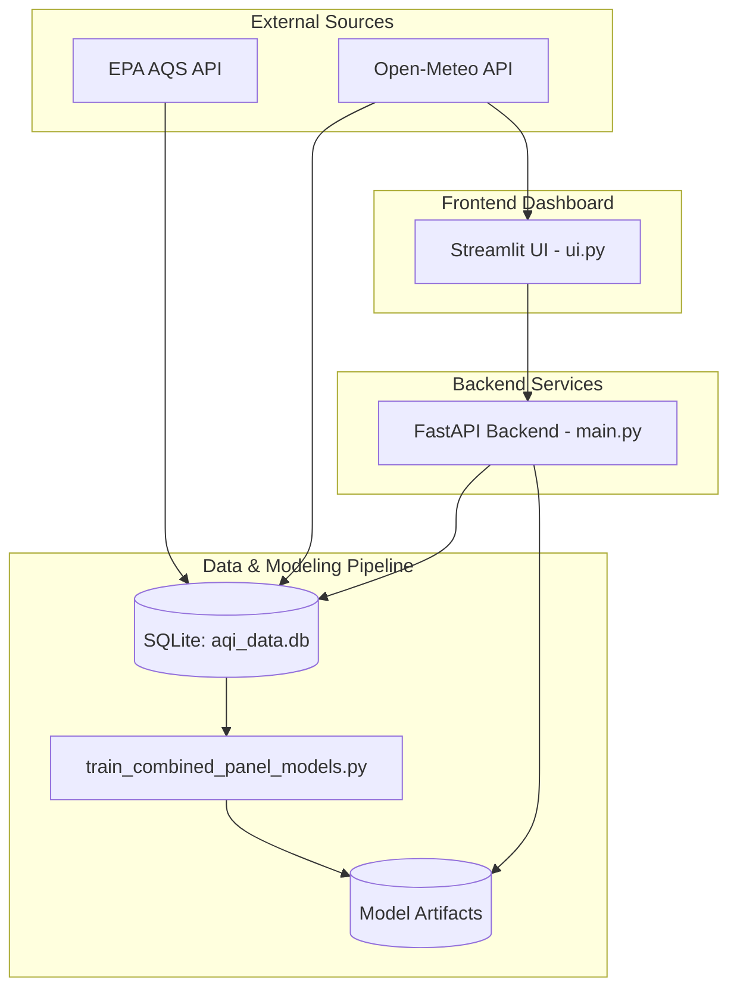

# System Architecture

The **California AQI Forecasting** project is a comprehensive machine learning system designed to predict Air Quality Index (AQI) values for multiple cities in California (Fresno, Los Angeles, and San Jose). The architecture is divided into three primary layers: Data & Modeling Pipeline, Backend Services, and Frontend Dashboard.

## 1. High-Level Architecture

## 2. Components Description

### 2.1 Data & Modeling Pipeline
- **Database (`aqi_data.db`)**: A SQLite database that stores historical AQI readings and weather data collected from EPA AQS and Open-Meteo.
- **Training Script (`train_combined_panel_models.py`)**: The core machine learning pipeline. It handles data loading, feature engineering (lags, rolling averages, VPD), and training multiple gradient boosting models (LightGBM, XGBoost, CatBoost) and baselines. It manages various forecast horizons (1-3h, 6h, 12h, 18h, 24h).
- **Model Artifacts**: Trained models are saved as text/JSON files in the `models/` directory alongside their metadata.

### 2.2 Backend Services
- **FastAPI (`main.py`)**: A high-performance REST API that serves predictions.
  - Loads the trained LightGBM models into memory upon startup.
  - Exposes endpoints to predict single horizon AQI (`/predict`) and a 24-hour timeline (`/predict_timeline`).
  - Includes a SHAP TreeExplainer for real-time model interpretability.
  - Queries `aqi_data.db` to fetch historical readings required to compute lag and rolling features on the fly.

### 2.3 Frontend Dashboard
- **Streamlit (`ui.py`)**: An interactive web dashboard.
  - Allows users to select stations and forecast horizons.
  - Fetches real-time weather from Open-Meteo and current AQI from the local database.
  - Calls the FastAPI backend to get predictions.
  - Renders UI elements: 3D PyDeck spatial heatmap, timeline line charts (Plotly), and SHAP feature importance charts.
  - Evaluates weather conditions to issue Air Stagnation Alerts.

## 3. Technology Stack
- **Languages**: Python 3.11+
- **Machine Learning**: LightGBM, XGBoost, CatBoost, Scikit-Learn, SHAP
- **Web Frameworks**: FastAPI (Backend), Streamlit (Frontend)
- **Data Manipulation**: Pandas, NumPy
- **Visualization**: Plotly, PyDeck
- **Deployment**: Docker, Docker Compose
